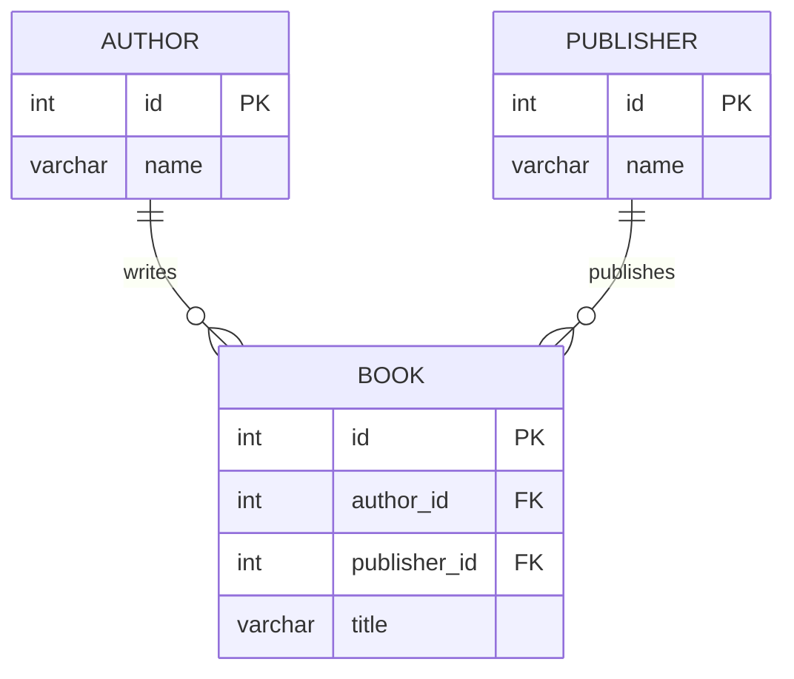

# ERD Generator
Turns domain requirements into a Mermaid `erDiagram`, confirms it compiles, and
makes an SVG image.
## Files
- Mermaid source: `docs/architecture/schema.mmd`
- Rendered image: `docs/architecture/erd.svg`
- Renderer/validator: `scripts/render_erd.js` (relative to this skill directory)
## Workflow
1. **Parse requirements.** Extract:
   - Entities (singular nouns, `UPPER_SNAKE_CASE` or `PascalCase`, no spaces)
   - Attributes with types
   - Primary keys (`PK`) and foreign keys (`FK`); every relationship's child entity needs an `FK` attribute pointing at the parent's `PK`
   - Cardinalities and whether each relationship is required or optional
2. **Draft the diagram** and write it to `docs/architecture/schema.mmd` (create `docs/architecture` if missing). Overwrite the file each attempt.
3. **Validate and render** from the project root:
   `node .agent/skills/erd-generator/scripts/render_erd.js docs/architecture/schema.mmd`
   (or `node scripts/render_erd.js docs/architecture/schema.mmd` from this
   skill's directory).
4. **Self-correction loop.** If the output starts with `SYNTAX_ERROR:` (exit code 1):
   - Read the error trace and find the error  line/token.
   - Fix `docs/architecture/schema.mmd` and re-run step 3.
   - Retry up to 3 times (4 total attempts). Make a targeted fix each time; do not change the model's meaning to avoid an error.
   - If the trace is not a Mermaid parse problem (e.g. `command not found`, Chromium/puppeteer launch or sandbox failure, missing input file), stop retrying and report the environment problem instead.
   - If all retries fail, show the last error and the last draft. Do not claim an image was produced.
5. **Final output** (only after `SUCCESS`):
   - Present the final Mermaid source in a ```` ```mermaid ```` block.
   - Reference the rendered image at `docs/architecture/erd.svg`.
   - Briefly list any assumptions made about the requirements.
## Mermaid ERD syntax rules
- Start the file with `erDiagram`.
- Entity block: `ENTITY { type name KEY }`. Keys are `PK`, `FK`, `UK`;
  combine with a comma (`PK, FK`). An optional comment goes last, in quotes.
- Relationship: `PARENT ||--o{ CHILD : "label"`. The label is required, and
  quoted if it contains spaces.
- Cardinality markers (left side reads for the left entity, right for the right):
- `--` is an identifying (solid) relationship; `..` is not identifying.
- Common causes of `SYNTAX_ERROR`: spaces in entity or attribute names, types containing parentheses such as `varchar(255)` (use `varchar`), a missing relationship label, a missing closing `}`, and unquoted special characters in comments.
## Example
